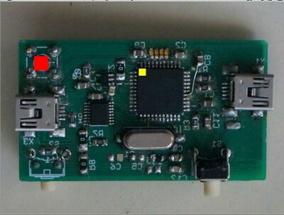

* Input:   1-PPS from GPS receiver connected to Timer 3 input capture
         also connected to GPIO INT2 pin
* Output:  PWM followed by a low pass filter to act as a D/A converter
* Control: microprocessor frequency

Requires ``simavr``, available at https://github.com/buserror/simavr
1. clone simavr
2. to make visualization of the GPIO status easier, add to ``avr_ioport_write()`` in 
``simavr/sim/avr_ioport.c`` the following display function

```
static void avr_ioport_write(struct avr_t * avr, avr_io_addr_t addr, uint8_t v, void * param)
{printf("\nSIMAVR: IOPORT @0x%x<-0x%x\n",addr,v);fflush(stdout);
 avr_ioport_t * p = (avr_ioport_t *)param;
 [...]
```

3. copy this directory in the examples subdirectory of ``simavr``
4. install ``libelf-dev`` if not available (required dependency)
5. in simavr: ``make``
will recursively compile all board examples including the content of this directory.
6. execute ``./examples/board_project/obj-x86_64-linux-gnu/PPScontrol.elf``

The graphical user interface requires libdevil [1], installed on Debian GNU/Linux with
``apt-get install libdevil-dev``

If not available, remove support for the GUI (not mandatory) by replacing
``#define with_GUI``
with
``#undef with_GUI``

[1] libdevil-dev - Cross-platform image loading and manipulation toolkit

When using the graphical user interface option, the red square indicates 1-PPS has been
triggered, and yellow square indicates input capture has occured:


